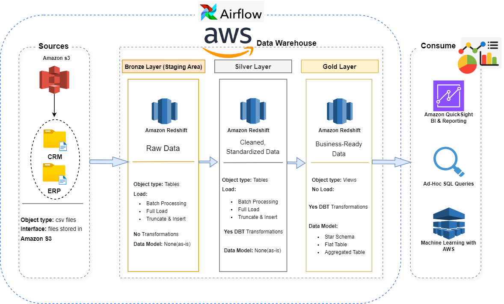
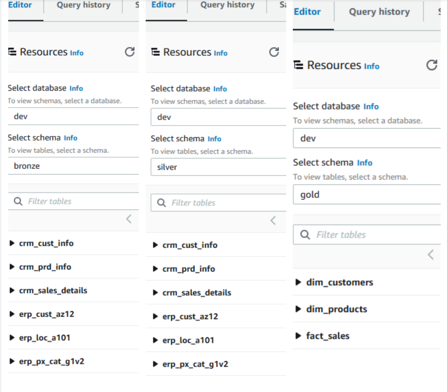
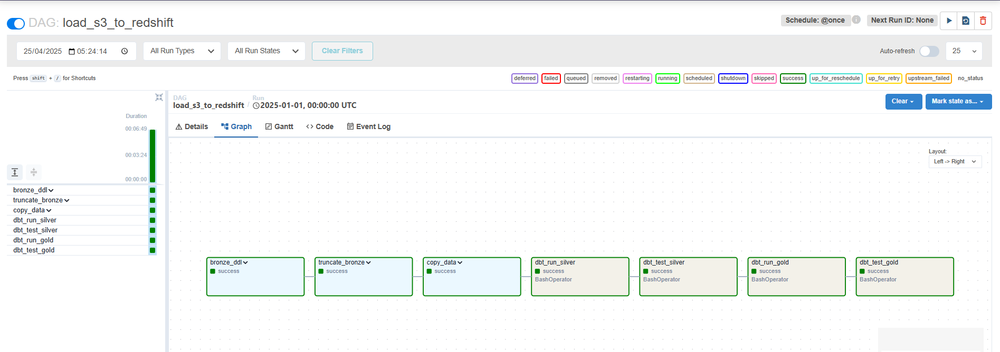

# 🚀 AWS Data Warehouse ELT Project

Project Summary: Modern ELT Pipeline with Airflow, Redshift & dbt.

This project showcases a production-grade ELT pipeline built on AWS, orchestrated with Apache Airflow, powered by Amazon Redshift, and modeled using dbt. Here's a breakdown of the full data journey:

🛠️ Bronze Layer: Schema & Raw Ingestion.

We kick off by building the foundational structure in the Bronze layer. Redshift DDL scripts create schemas and tables for CRM and ERP systems, followed by a clean-up phase that truncates existing data to ensure a fresh load. Then, raw CSV files are securely ingested from Amazon S3 into Redshift using highly-optimized COPY commands.

🔄 Silver Layer: Data Transformation with dbt.

Once the raw data lands, we level up to the Silver layer where dbt (data build tool) runs curated transformation models. These models clean, validate, and enrich the data—turning chaos into clarity. Post-transformation, automated tests are executed to ensure integrity and trustworthiness.

🏆 Gold Layer: Business-Centric Models & Final QA.

In the final stage, the Gold layer focuses on delivering business-ready datasets. Aggregations, KPIs, and domain-specific insights are built using dbt and tested rigorously to guarantee quality. This ensures analytics and downstream systems consume clean, tested, and high-value data.

✅ From raw files in S3 to trusted business insights in Redshift, this pipeline follows the best practices of modern data engineering—automated, modular, and production-ready.



---

## 🧠 Key Features

- ⚙️ **Airflow Orchestration**: Task scheduling, logging, and monitoring via DAGs.  
- 🪣 **Data Lake on S3**: Stores raw and intermediate files (Bronze & Silver layers).  
- 🧽 **ELT Design**: Transformation logic is handled in Redshift using dbt.  
- 🛢 **Data Warehouse**: Redshift holds the final star-schema (Gold layer) optimized for analytics.  
- 📈 **Modular and Scalable**: Built for extensibility and cloud-scale workloads.

---

## 🗂️ Project Architecture

This project follows the **Medallion Architecture** pattern using AWS-native services and transformation layers powered by **dbt**.

### 🧱 Medallion Architecture Layers

1. **Bronze (DDL Definitions)**: Create base staging tables in Redshift.  
2. **Silver (Cleaned Data)**: Load and clean raw data using SQL models in dbt.  
3. **Gold (Data Mart)**: Star schema (facts and dimensions) ready for analytics.




---

## 🔁 DAG Workflow

The main DAG `load_s3_data_to_redshift.py` orchestrates the entire ELT flow:

1. **Stage to Redshift**: Copies raw CSV files from S3 to Redshift.  
2. **DDL Creation (Bronze)**: Executes Redshift SQL scripts to create schema and base tables.  
3. **Run dbt Models**:  
   - **Silver Layer**: Cleans and prepares the data.  
   - **Gold Layer**: Builds dimension and fact tables.  
4. **Data Quality Checks** *(using dbt test)*: Ensure integrity before marking pipeline as successful.


---

## 📁 Repository Structure

```bash
aws-data-warehouse-ELT-project/
│
├── dags/
│   └── load_s3_data_to_redshift.py       # Airflow DAG
│
├── include/
│   └── datasets/                         # Optional: raw datasets (local testing)
│
├── dbt/
│   ├── dbt_packages/
│   ├── logs/
│   ├── macros/
│   ├── models/
│   │   ├── gold/                         # Final dimensional models
│   │   │   ├── dim_customers.sql
│   │   │   ├── dim_products.sql
│   │   │   ├── fact_sales.sql
│   │   │   └── schema.yml
│   │   └── silver/                       # Cleaned data layer
│   │       ├── crm_cust_info.sql
│   │       ├── crm_prd_info.sql
│   │       ├── crm_sales_details.sql
│   │       ├── erp_cust_atz12.sql
│   │       ├── erp_loc_a101.sql
│   │       ├── erp_px_cat_g1v2.sql
│   │       ├── schema.yml
│   │       └── sources.yml
│   ├── target/                           # dbt compiled/run outputs
│   ├── dbt_project.yml
│   ├── profiles.yml
│   ├── packages.yml
│   └── package-lock.yml
│
├── logs/                                 # Airflow log directory
│
├── scripts/
│   └── ddl_bronze/                       # Redshift DDL scripts
│       ├── create_crm_cust_info.sql
│       ├── create_crm_prd_info.sql
│       ├── create_crm_sales_details.sql
│       ├── create_erp_cust_atz12.sql
│       ├── create_erp_loc_a101.sql
│       ├── create_erp_px_cat_g1v2.sql
│       ├── create_schema.sql
│       ├── grant_allusersql.sql
│       └── grant_usage_public.sql

